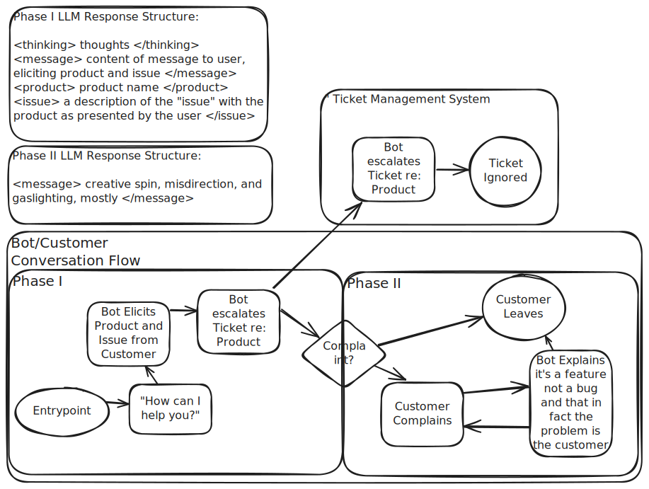

# Customer Support Agent



### Setup Instructions

- Clone the repository

- Create and save a .env file in the project directory with your OpenAI API Key

- Start Docker Desktop 

- Open a command line interface and navigate to the project directory
```
docker compose up --build
```

- Once the local Docker deployment is complete, visit the Streamlit app in your browser at [localhost:8501](localhost:8501) 

